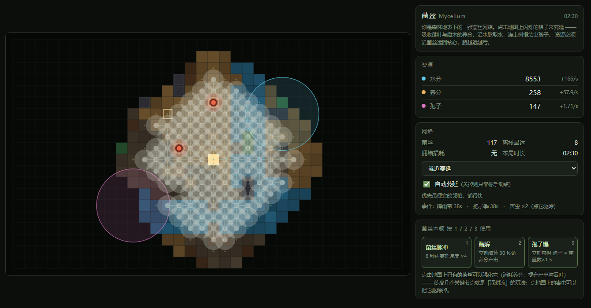

# 菌丝 Mycelium

**▶ 立刻开玩：<https://liuyuling528-oss.github.io/mycelium/>**
（不用下载、不用注册，打开就能玩。也可以双击 `index.html` 离线玩，Phaser 已内置在仓库里）

---

你是一粒落在森林土壤里的孢子。

向下扎根，向四周蔓延菌丝，在落叶与腐木里找养分，沿地下暗河取水，
连上树根结出孢子 —— 这就是科普里说的 **"Wood Wide Web"**，一张真实存在于森林地下的菌根网络。

网络越铺越大，但资源必须一格一格运回核心，**路越远越亏**。
所以「近处的贫瘠壤土」和「远处的富矿」之间永远要做取舍，
而这正是它和大多数放置游戏不一样的地方：**你得看地图，不能只盯着数字涨**。



> 白色是你养起来的菌丝网络，金色是孢子落点（核心）。
> 蓝紫色的半透明大圈是事件增益区，红色标记是已被害虫占据、停止产出的节点。

---

## 三十秒上手

| 你想做的事 | 怎么做 |
|---|---|
| 长一格菌丝 | **点击带圆点的空格**（金色脉冲框是当前策略推荐的位置） |
| 强化现有菌丝 | **点击已有的菌丝** —— 等级越高，产出和吞吐都越高 |
| 驱除害虫 | **点击红色的害虫**，还有养分奖励 |
| 放技能 | **按 1 / 2 / 3** |
| 移动视野 | **按住拖动**；**滚轮**缩放；触屏用**双指捏合** |
| 回到自动取景 | 右上角 **⟲** 按钮 |

地图上的颜色就是底下的东西：

- ⬛ **深棕 = 普通壤土**（占地图大半，**从核心数第 5 格起不再产水**，更远反而倒扣 —— 见下）
- 🟤 **棕色 = 落叶层**（产养分）　🟤 **深棕偏红 = 腐木**（养分最高）
- 🔵 **蓝色 = 地下水脉**（产水，且**不受距离递减影响**）　🟢 **绿色 = 树根**（产孢子）
- ⚫ **深灰 = 岩块**（长不进去）

蓝紫色半透明的大圈是**事件增益区**（区域内对应资源 ×3），值得专门绕路去吃掉它。

---

## 三件必须权衡的事

这三条是整个游戏的骨架。看懂它们，就知道该往哪长。

**1. 资源要运回核心，路越远越亏**

每多一格距离，运输效率就掉一截。20 格外的产出只剩一半左右。
所以「近处低产」和「远处高产」是真取舍 ——
「运输效率」升级的意义，就是把远处的富矿变得值得修路。

**2. 会堵**

每个节点有吞吐上限，超了只有 30% 挤得过去。
面板上的**「拥堵损耗」就是升级「菌丝加粗」的信号**。
（注意：堆产能升级会加剧拥堵，必须搭配加粗。这也是为什么不能无脑只点一个升级。）

**3. 壤土只在近处值钱**

**普通壤土**（地图上占一大半的深棕背景地）是唯一**随距离恶化**的地块。
它的产出是一条直线，**每远离核心一格就固定少 0.03 水**：

| 从核心数第几格 | 1 | 2 | 3 | 4 | **5** | 6 | 10 | 21 | 41 以上 |
|---|---|---|---|---|---|---|---|---|---|
| 每格每秒产水 | 0.12 | 0.09 | 0.06 | 0.03 | **0** | −0.03 | −0.15 | −0.48 | **−1.05**（地板） |

**从核心数第 5 格是精确的归零点**：前 4 格还产水，第 5 格刚好为 0，
再往外**每铺一格都在倒扣水**。负值是**真扣**，和维持费走同一本账。

> **在哪能看到它生效？**
> ① **左侧「水分」行下面**会多出一行**「壤土递减 N 格 −X.XX/s（越远扣得越多）」** ——
>    这是全网的合计倒扣量。**只有真的有格子被倒扣时才会出现**，
>    你一铺过第 5 格，这行立刻带着负数冒出来。
> ② **鼠标悬停任意一格**，提示分两行把账算给你看：
>    ```
>    水 -0.03/s
>    0.12 − 0.15 = -0.03（从核第 6 格）
>    ```
>    第一行是**结论**（负号顶头，没有加号），第二行是**算式**（基准 − 递减）。
>    距离一律数成「**从核第 N 格**」——核心自己就是第 1 格，
>    所以第 5 格正好归零、第 6 格开始变负。
> ③ 水分那一行的速率是**净值**，壤土的倒扣已经算在里面了。
>    速率**为负时会显示负号**（`-1.20/s`），全池子都在净失水的时候一眼就能看出来。

这就是它和「无脑铺满」的根本区别所在：

- 壤土是**路**，不是**矿**。它的职责是把网络接起来，不是给你送钱。
- 真正的收益来自**远处的特殊基质** —— 水脉（水 1.0/s）、腐木（养分 1.8/s）、树根（孢子 0.4/s），
  它们**不受这条规则影响**，仍然是「越远越值钱」的富矿。
- 所以「铺多远」要算的是：**修过去够到的富矿，值不值得沿路那几十格壤土的倒扣**。

每个菌丝节点还会微量产孢子（0.010/s）—— 铺网络本身不会毫无收获，
但**光靠铺壤土想攒水**这条路已经堵死了。

> 面板上水分那一行变红，可能是三件事：维持费太高、练级太散、或者**路铺得太远**。
> 这条机制同时给了「深耕流」和「通铺流」一次真实的对比：前者贴核，后者贴亏损。

---

## 水分是要养的，不是白拿的

**每个练过级的菌丝都在持续耗水**，而且**等级越高，涨得越快**：

| 等级 | Lv1 | Lv3 | Lv5 | **Lv7** | Lv10 |
|---|---|---|---|---|---|
| 每秒耗水 | 2 | 18 | 51 | **100** | 204 |

水的用途不只是铺新格子 —— 它同时也是整张网络的**维持费**。

**为什么是这种「越练越贵」的形状**：如果按等级线性收费，那「10 朵练到 Lv10」
和「100 朵各练 1 级」成本完全一样 —— 而后者掉级时只掉 1 级、还分散在各处，
明显更划算。结果就是**摊大饼永远最优，没人愿意深耕**。
改成按等级平方收费后，两种布局差了 **10 倍**，深耕才真正有代价、
也才真正有回报。

**水不够了会怎样？** 分界线很清楚，就一条：**水有没有见底**。

1. **只要水还有余额（> 0），一级都不会掉。** 网络照常供养，你只是在慢慢耗水 ——
   哪怕水位只剩一点点，也还是正常运转。
2. **水归零的那一刻开始掉级** —— 每秒 3 级，离核心**最远的那些节点先掉**。

- 掉级只是**退回上一级**（产出和吞吐变回去），**节点永远不会消失**
- 水位一旦恢复为正，**掉级立刻停** —— 不用等，也没有「欠账清算」
- 你想保住远处的富矿，就得沿路多留水
- 想省水，就**把等级集中在靠近核心的地方** —— 这是「深耕流」的真正形态

面板上水分那一行会显示 `+净流（维持 -X）`。**水变成 0 的那一刻它变红**，
等级同时开始往下掉 —— 那就是该买「水分效率」、或者少练几个远处节点的时候。

> 这条机制是为了让「练节点」有真实代价。在此之前，水在铺满地图后就彻底没用了（实测 20 分钟能涨到 82 万）。
> 另外：**没练过级的菌丝（Lv0）不耗水** —— 只是铺路不收费。

---

## 四个动词，而不是两个

早期版本的放置游戏只有「点格子」和「买升级」，点完就只能干等。
这里每时每刻都有事可做：

| 系统 | 是什么 |
|---|---|
| **节点强化** | 点击已有的菌丝给它升级，把一片土地「深耕」成高产区 |
| **主干 / 汇流** | 把少数几格改造成「主动脉」，为**核心**扩容（见下） |
| **树木** | 把树根养大：古树给周围 +25% 产出，但围太挤会把它压回去（见下） |
| **主动技能（1 / 2 / 3）** | 菌丝脉冲（蔓延 ×4）、酶解（立刻结算 30 秒养分）、孢子爆（孢子 = 菌丝数 ×1.5）。带冷却，攒时机打一波爆发 |
| **地图事件** | 降雨带 / 孢子季（区域产出 ×3）、害虫（占据节点使其停产，点掉有奖励） |
| **菌瘟** | 后期挑战：会**沿菌丝蔓延**的感染，不管它就一直往核心爬（见下） |
| **拆除** | 「网络结构」里的第 4 个模式：撤掉一格（不退水），用来给树腾地方 |

---

## 主干：给核心扩容

网络的货（养分 + 孢子）全都得汇到核心才算数。
但**核心本身的吞吐是固定的**，你没法给它练级 —— 网越大，它越堵。

答案在结构上：在右侧「网络结构」卡片切到**主干模式**，然后点地图上的菌丝，
把它标成主干。**每一根主干都直接给核心扩容。**

全网络只有 **5 格**主干。所以你必须回答一个问题：

> **哪几格最不值得留着产货？**

因为被改造成通道的格子，**自己的产出会掉到 55%**。
拿一块腐木（养分 1.8/s）当主动脉，等于白扔一半产量；
拿一处水脉（本来只出水，而水不受吞吐限制）则几乎不要钱。

**实测这两个选择的收益差 11%**，而且主干把「拥堵损耗」压掉了 85%。
选在哪里，是真的有区别的。

还有 **3 格汇流**：多条支流挤到一处时，把那一格标成汇流，
它的吞吐也会提高，而且**紧贴着它的支流吞吐再 ×1.35** ——
支流停在哪一格，也是个决定。

---

## 树木：花时间，不花资源

地图上有一种 **树根** 格。在它上面长一格菌丝，长出来的不是普通菌丝，
而是一棵**树** —— 它会自己长大，你不用花升级点，只花时间。

**幼苗 → 成年 → 古树**（约 1 分钟、3 分钟），自身产出 0.6× → 1.0× → 1.6×。
但树真正值钱的地方不在这里：

> **古树会给周围 2 格内的其它菌丝 +25% 产出。**

这是它和「更肥的格子」的区别 —— 一棵古树能带动一小片，
所以**树该种在哪、种在谁旁边**，是个真正的空间决策。

**代价是：树周围不能太挤。**
树会把地下的养分分给周围的菌丝，围过来的越多，它自己越吃不饱。
「周围」指以这棵树为中心、2 格半径内的**所有菌丝格数**（含斜角）：

| 周围菌丝数 | 树的表现 |
|---|---|
| 16 格以内 | 满速成长 |
| 17 格 | 减速（还长，但慢了） |
| 18 格 | 停住 |
| 19 格 | **开始倒退** |
| 20 格 | 倒退最快 —— 会从古树退回成年、甚至退回幼苗 |

**注意 20 格就是上限**（2 格圆里最多站 20 格），
所以「全速成长」和「开始退化」之间只隔 4 格 —— 树是很敏感的。

实测数据：正常铺开的网络里，树周围的菌丝数**中位数就有 19 格**。
也就是说**随大流铺，树一定是长不起来的**；想养出古树，必须刻意腾地方。
而且不是每棵树都值得腾 —— 实测约 **9% 的树**周围被岩石挡住，
最多只能站 17 格，怎么腾都成不了气候，这种就别浪费格子了。

铺错了也不要紧：右侧「网络结构」里有**拆除模式**，点一下就撤掉一格
（不退水），用来给树腾地方 —— 这是养树流的标配操作。

---

## 菌瘟 —— 后期真正的对手

网络长到 32 格之后，地图上会开始出现**菌瘟**：一种会顺着菌丝一格一格往里爬的感染。
被感染的节点**完全停产**，而且**点它没有用** —— 净化不掉的。

**它是唯一一个「放着不管会变糟」的东西**，所以后期你必须真的看着地图做决定。

### 怎么对付它

菌瘟有个等级。**只能传染给等级不高于它的邻居。**

所以答案很简单：**把去路上的菌丝练得比它高，就能挡住它。**

> 举例：瘟是 Lv3，旁边一朵 Lv4 的菌丝就足够挡住去路。
> **练到 Lv7 就彻底安全了** —— Lv7 以上的菌丝完全免疫，菌瘟既不会在上面
> 滋生、也传不进去。这是这场瘟疫的终点线：练到就不怕。

挡无可挡怎么办？**围死它**：

- 菌瘟每 **21 秒**尝试往外传一次
- **传得出去，就一直烂下去** —— 它不会自己好
- **连续 2 个周期一个邻居都传不进去（被围死），它就熄灭**，
  节点保留、恢复健康

换句话说：**它不会造成永久损失，但会一直吃你的产能，直到你动手处理。**
每一处菌瘟头上都有一圈紫色倒计时环，你能看清它下一步往哪爬、还有多久。

最多同时存在 8 处；达成里程碑「防火墙」后，它蔓延得更慢。

---

## 自动蔓延要解锁

新局开局**没有自动蔓延**，网络得你自己一格格点出来。
满足两个条件后由里程碑「感知」解锁，**永久生效**：

1. **连上全部 4 种特殊基质**（落叶层 / 水脉 / 腐木 / 树根）
2. **菌丝历史最高达到 250 格**

进度跨转生保留，转生不会倒扣。

于是前期节奏是这样：**手动点击跑图 → 找齐基质、把网络铺到 250 → 解锁挂机 → 开始滚雪球。**

解锁后可以选**扩张策略**（面板上随时切换），决定它往哪长：

| 策略 | 倾向 |
|---|---|
| 就近蔓延 | 优先最便宜的邻格，铺得快 |
| 择优蔓延 | 优先原始产出最高的邻格 |
| 找水脉 | 优先水脉，扩张续航强 |
| 找养分 | 优先落叶与腐木，升级快 |
| 找树根 | 优先树根，专攻散播 |

**嫌它铺得不对？** 面板上还有两条规则可以直接卡住它：

- **距离上限** —— 只往离核 N 格以内蔓延。挂机时它不会再把水拉到地图另一头。
- **收益阈值** —— 原始产出低于 N 的格子直接不连。不想让它去啃贫地时用。

两条都设成「不限」时它按上面的倾向铺满所有够得到的地方。
**手动点击永远不受这两条限制** —— 想现在连哪格就连哪格。

---

## 转生：散播孢子

养分与孢子攒够了，就能**散播孢子**重开一轮。

- 网络全部重来，换成**基因点**
- 基因点可买**永久天赋**（丰饶 / 蓄水 / 速生 / 渗透），一轮比一轮快
- 代价：上一张地图的探索记录作废 —— 换图前记得看一眼

### 每次转生，从三张卡里挑一张

孢子落地的那一刻会弹出**三选一**，这是转生真正有意思的地方：

| 卡 | 拿到什么 | 换来什么 |
|---|---|---|
| **菌株** | 白拿一种新菌株（见下一节） | 换一套打法 |
| **扩大地图** | 地图边长 +12%（最多长到基础面积 4 倍） | 更多资源点，但路更远、探索要重来 |
| **基因点** | 直接多给一批基因点 | 更快买满永久天赋 |

**地图不再随转生自动变大** —— 想要更大的地图，就得**放弃**那一轮的菌株和基因点。
这是刻意的取舍：白拿的东西不算选择。

三张卡的权重会被引擎保证「每一类只要还有货就至少占一个位置」，
所以不会出现「某张卡永远抽不到」的恼人情况（抽卡的实现见 `DEVELOPMENT.md`）。

已探明的地图在你离开后依然留在存档里，回来接着玩。
即使关掉页面时正好停在三选一上，回来它还在等你点。

---

## 菌株：让每一轮的 Build 不一样

光是数值变大，第二轮的玩法和第一轮还是一模一样。
**菌株**换的是**规则本身** —— 同一个网络，换个菌株就是另一套打法。

菌丝铺到 **40 格**后解锁第一个**槽位**，在面板上随时换上换下：

| 菌株 | 改变的东西 | 代价 |
|---|---|---|
| **速生** | 生长成本大幅下降，铺网飞快 | 运输沿距离的损耗变重 |
| **运输** | 拉近了等于没损耗，远端的养分也送得回来 | 生长本身更贵 |
| **根系共生** | 树根产量与散播收益大涨 | 离开树根的地方产出缩水 |
| **腐生** | 腐木上的产出翻倍，且与树根形成共鸣 | 非腐木格产出下降 |

**加成是相乘不是相加**：两个菌株的加成叠在同一格上会相乘。
这不是为了「更强」—— 恰恰相反，**它让搭配会出现互相拆台**：

> 速生的距离损耗会吃掉腐生的收益，
> 实测「速生 + 腐生」并不比单带腐生更强（`headless_sim` E 组）。

所以**选错组合不如只带一个**。这正是这一步的目的：
**存在要动脑的搭配，而不是无脑把两个槽塞满。**

**第二个槽位来自里程碑「共生菌株」**（转生过 ≥1 次 + 菌丝历史最高 400 格），
所以第一轮只有一个槽，第二轮才开始真正组合。菌株**跨转生保留**，
和基因一样属于「Build 选择」而不是一次性 Buff。

---

## 离线收益：走开也有收成，但别指望它

关掉页面过一阵回来，面板会弹一张卡：**你离开了多久、带回了多少**。

规则很简单：

- **按你离开时的网络产能折算** —— 规划得越好，回来拿得越多
- **只有在线主动操作的约 12%** —— 挂着等永远追不上动手玩
- **最多结算 8 小时**，再多也是这个数
- **离开不到 1 分钟不结算**（切个标签页回来不该弹卡）

**早期玩家也不会空手而归**：哪怕你只有一格核心、自动蔓延还没解锁，
离线期间也会按核心渗水给一份**基础产出兜底** ——
不会出现「回来一看什么都没发生」。

---

## 上手之后

游戏里有 **11 条里程碑** 渐进解锁各种功能，不会一开局就把所有东西摆在你面前：

扎根 → 寻水 → 腐殖 → 共生 → 主干 → 扩张 → 抗虫 → 循环 → **防火墙** → **感知** → **共生菌株**

以及 **8 项升级**（吸收效率 / 水分效率 / 运输效率 / 菌丝加粗 / 生长效率 / 共生深度 / 蔓延速度 / 感知范围）、
**4 项基因天赋** 和 **4 种菌株** —— 它们之间有真实的竞争关系，不可能全都买满。

存档自动保存在浏览器里，关掉页面下次接着玩。

---

## 存档

面板最底下是**存档卡片**，三个按钮各管一件事：

| 按钮 | 作用 | 会动到什么 |
|---|---|---|
| **开始新游戏** | 彻底重来：基因、知识、转生记录**全部清空** | 有二次确认，无法撤销 |
| **保存** | 手动写一次自动存档 | 只是不用等关页面 |
| **槽位卡片** | 点「保存」展开三个存档槽 | 每槽可 **存入 / 读取 / 覆盖 / 删除** |

**为什么要有槽位**：自动存档永远只保存**当前这一局**，每次保存或关页面都会覆盖它。
所以如果只有一个存档位，「读取」读到的就是刚刚被覆盖的当前局 —— 等于没有读档。
槽位是**手动拍下的快照**，不会被自动流程动到，可以随时回到某一局的某个时刻。

槽位上显示 **菌丝格数 / 本局时长 / 多久前存的 / 转生次数**，
一眼就能认出哪个是你想回到的那一局。空槽只能「存入」，有档的槽才给读取和删除。

---

## 屏幕适配

- **桌面**：左边地图铺满，右边面板独立滚动，地图始终钉在视口里
- **手机**：单列，地图吸在顶部，一边看网络一边改策略
- **触摸有 1 格容差**：手指点偏一格会自动落到旁边可操作的格子（鼠标不启用，桌面行为不变）
- **镜头会自动取景**：视野跟着已探明区域走，网络长大了缓缓拉开，
  并且**绝不裁掉网络的任何一部分**

---

## 关于这个项目

- 引擎：**Phaser 3.80** + 原生 JS 模块，无构建步骤，无依赖安装
- 纯离线可玩：Phaser 内置在 `vendor/`，双击 `index.html` 即可
- 授权：**MIT** —— 见 [`LICENSE`](LICENSE)，可自由使用、修改、分发（含商用）

想改数值？所有平衡参数都集中在 **`src/config.js`** 一个文件里。
开发约定、验证方法、以及踩过的坑，见 **[DEVELOPMENT.md](DEVELOPMENT.md)**。
